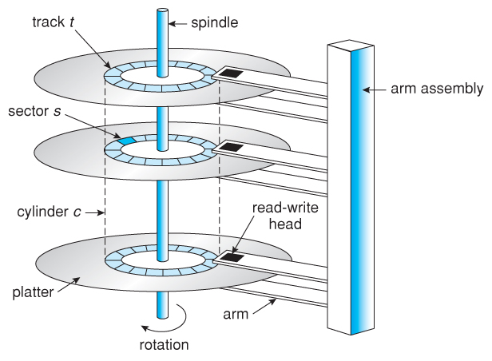

#Disk Storage
## Memory Hierarchy
There are many levels of memories in a computer. Typically, the most common memory levels from *fastest/smallest/most expensive* to *slowest/largest/cheapest* are:

- Registers
- Random Access Memory (RAM)
- Disks

## Database on Disk

**Databse Mangement System (DBMS)** sotres information on **hard disk drive (HDD)** and uses it extensively. There are three reasons for that:

1. Disk is relatively cheap.
   - cost of HDD is $50 for 1TB.
   - cost of RAM is $50 for 8GB.
2. Disk has large capacity.
   - can be large enough to store PBs of data.
3. Disk is not volatile 
   - registers and main memory are volatile since they are wiped out after the machine is shut down.
   - disk keeps information as long as the disk itself is not broken.

When performing queries, DBMS **READ**s data from disk to main memory or **WRITE**s data from RAM to disk. Both READ and WRITE are high-cost operations, and DBMS usually deals with huge amount of data, so **input/outputs (I/Os)** must be planned carefully to guarantee efficiency and performance.

Data is stored and retrieved in units called **blocks** or **pages**. The size of a page is determined by the hardware: the size of disk page, which is fixed for a particular disk. Because of the structure of HDD, the time to retrieve a disk page varies depending upon its location on disk. Therefore, the relative placement of pages on disk has major impact on DBMS performance. The detail is in the next section.

## Disk
### Components and Structures
Inside a HDD, there are several **platters**. On each platter, there are many **tracks** on both **surfaces** of the patter. Tracks of the same number on all surfaces of all platters make up a **cylinder**. On each track, there are **sectors**. Block (page) size is a fixed multiple of sector size, which is also fixed. The platters spin, and **arm assembly** is moved in or out to position **head**s on a desired track k. There is one head per surface. The head performs READs and WRITEs on the disk. 

### Access Time
The **access time** is the time to READ or WRITE a disk page. It is typically made up of 3 components:

- **Seek Time**: The time to move arm assembly to position the head at a cylinder/track.
- **Rotational Delay**: Wait for block to rotate under head.
- **Transfrer time**: the time for the disk area containing the page to rotate under the head.

Among them, seek time and rotational delay dominate. It is important to be able to compute the access time by hand. All of the formulas below are intuitive to understand, and are required to be familiar with. Keep in mind that the formulas are equitions so that they can go backwards and be manipulated.

#### Max Seek Time
$$T_{seekmax} = T_{setup} + \frac{n_{cyl} - 1}{v_{assem}}$$

#### Average Seek Time
$$T_{seekavg} = T_{setup} + \frac{n_{cyl}/3}{v_{assem}}$$

#### Max Rotational Delay
$$T_{rotmax} = \frac{1}{v_{rot}}$$

#### Average Rotational Delay
$$T_{rotavg} = \frac{1}{2v_{rot}} = \frac{1}{2}T_{rotmax}$$

#### Transfer Time
$$T_{trans} = \frac{n_{reqsec}}{n_{spt}} \times T_{rotmax}$$

- $T_{seekmax}$ is the max seek time.
- $T_{setup}$ is the setup time (usually given and fixed).
- $n_{cyl}$ is the number of cylinders.
- $v_{assem}$ is the speed for arm assembly to move between cylinders (usually with unit: $cylinder/s$).
- $T_{seekavg}$ is the average seek time.
- $n_{cyl}/3$ is the average number of cylinder to sweep over (reasoning to get $n_{cyl}/3$ is not required for the course).
- $T_{rotmax}$ is the max ratational delay.
- $v_{rot}$ is the rational speed (usually with unit: $rpm$).
- $T_{rotavg}$ is the average ratational delay.
- $T_{trans}$ is the tranfer time$.
- $n_{reqsec}$ is the number of requested sectors$
- $n_{spt}$ is the number of sector per track

**NOTE**: Remeber to convert units in calculation.

## Sequential/Random Page Arrangement and Access
To minimize access time, it is important to minimize the seek time and rotational delay. To achieve this goal, the pages of a file should be arranged *sequentially*. That is, it is better to arrange pages of the file *next* to the previous page. It is preferable to arrange and access:

1. blocks on the same track, followed by... 
2. the blocks on the same cylinder followed by...
3. the blocks on adjacent cylinders.

The efficiency of **sequential READ/WRITE** is higher than **random READ/WRITE** because there is almost no seek time and rotational delay between neighbor pages. Moreover, if data are stored sequentially, in a sequential scan of data pages, **prefetching** additional pages may improve performance even further. 

## HDD and SDD
**SDD** is **Solid State Drive**. SDD outperforms HDD in terms of lower noise, lower power requirements, and faster reads. However, we cannot use SDD to replace HDD in the near future because SDD is costly; it can be wrote for only a limited number of times; and most importantly, still not fast enough to make up the trade-off. 

